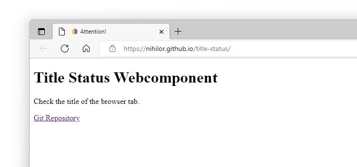

# title-status

Webcomponent to set different attracting indicators in the titlebar of a browser tab.

## Why?

Sometimes it's necessary to inform users that something on a website changed.

## What?

This webcomponent uses emojis to attract the user. It changes the visible emoji in the titlebar based on a predefined sequence.



## How?

Just include the webcompontent as a script in your HTML document. Create a new element named `title-status`. See the [demo on https://nihilor.github.io/title-status/](https://nihilor.github.io/title-status/).

```html
<head>
    <title-status indicator="moon" interval="125" caption="Attention!" playback="playback"></title-status>
</head>
```

The benefit of this solution encapsulated in a webcomponent is, that it can be used declaratively and imperatively, in pure HTML as well as in Angular, Vuejs, React, Svelte and any framework you can imagine. Additionally, data bindung is for free.

The webcomponent may also be used in the `body` section, and multiple time to prepare different indicators.

```html
<body>
    <title-status id="status-attn" indicator="moon" interval="125" caption="Attention!" playback="playback"></title-status>
    <title-status id="status-dngr" indicator="contrast" interval="100" caption="DANGER!"></title-status>
    <title-status id="status-look" indicator="hands" interval="250" caption="Look here!"></title-status>
</body>
```

## Attributes

The webcomponent has the following attributes:

### indicator

Sets one of the predefined indicator sequences.

Possible values for `indicator` are:

* `hearts`: a sequence of red, yellow and green hearts
* `squares`: a sequence of red, yellow and green squares
* `clock`: a sequence of 12 hours as an analogue clock
* `moon`: a sequence of the moon phases
* `weather`: a sequence of rain, rainy, cloudy and sunny
* `circles`: a sequence of red, yellow and green circles
* `contrast`: a short sequence of a tiny and big black-white-square
* `hands`: a sequence of three hands pointing to right

Example:

```html
<title-status indicator="moon"></title-status>
```

### interval

Sets the time in milliseconds after the emoji will be changed.

Example:

```html
<title-status interval="125"></title-status>
```

### caption

Sets the text that is used in combination with the emoji to be shown in the titlebar.

Example:

```html
<title-status caption="Attention!"></title-status>
```

### playback

Starts and stops the playback. Set the value to `playback` to start the playback or to any other value to stop.

Example:

```html
<title-status playback="playback"></title-status>
```

## LICENSE

MIT License

Copyright (c) 2022 Mark Lubkowitz

Permission is hereby granted, free of charge, to any person obtaining a copy
of this software and associated documentation files (the "Software"), to deal
in the Software without restriction, including without limitation the rights
to use, copy, modify, merge, publish, distribute, sublicense, and/or sell
copies of the Software, and to permit persons to whom the Software is
furnished to do so, subject to the following conditions:

The above copyright notice and this permission notice shall be included in all
copies or substantial portions of the Software.

THE SOFTWARE IS PROVIDED "AS IS", WITHOUT WARRANTY OF ANY KIND, EXPRESS OR
IMPLIED, INCLUDING BUT NOT LIMITED TO THE WARRANTIES OF MERCHANTABILITY,
FITNESS FOR A PARTICULAR PURPOSE AND NONINFRINGEMENT. IN NO EVENT SHALL THE
AUTHORS OR COPYRIGHT HOLDERS BE LIABLE FOR ANY CLAIM, DAMAGES OR OTHER
LIABILITY, WHETHER IN AN ACTION OF CONTRACT, TORT OR OTHERWISE, ARISING FROM,
OUT OF OR IN CONNECTION WITH THE SOFTWARE OR THE USE OR OTHER DEALINGS IN THE
SOFTWARE.
